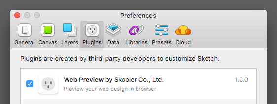
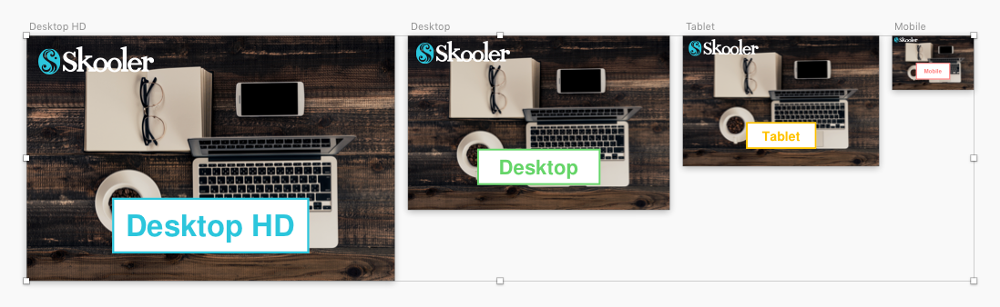
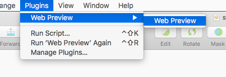

# Web Preview Sketch Plugin

A Sketch plugin to preview your web design in browser.

## Prerequisites

* Sketch 41+

## Installing

The easiest way to install is download [one of the releases](https://github.com/skooler/sketch-plugin-web-preview/releases) and install the plugin in Sketch. Once installed the plugin can be automatically updated through the Sketch Plugin Manager.

[Download the latest release »](https://github.com/skooler/sketch-plugin-web-preview/releases/latest)

## Usage

First, select one or more artboards. If you select more than one artboard, its regarded as responsive design.

After the selecting artboard, execute the plugin from the _Plugins_ menu.

The browser opens automatically, and shows the preview. If you change the size of the browser, the appropriate artboard will be displayed.

## License

MIT
